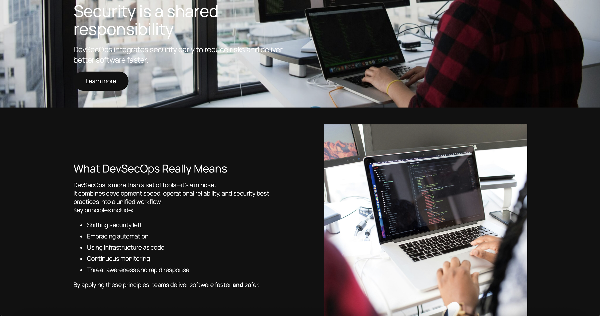
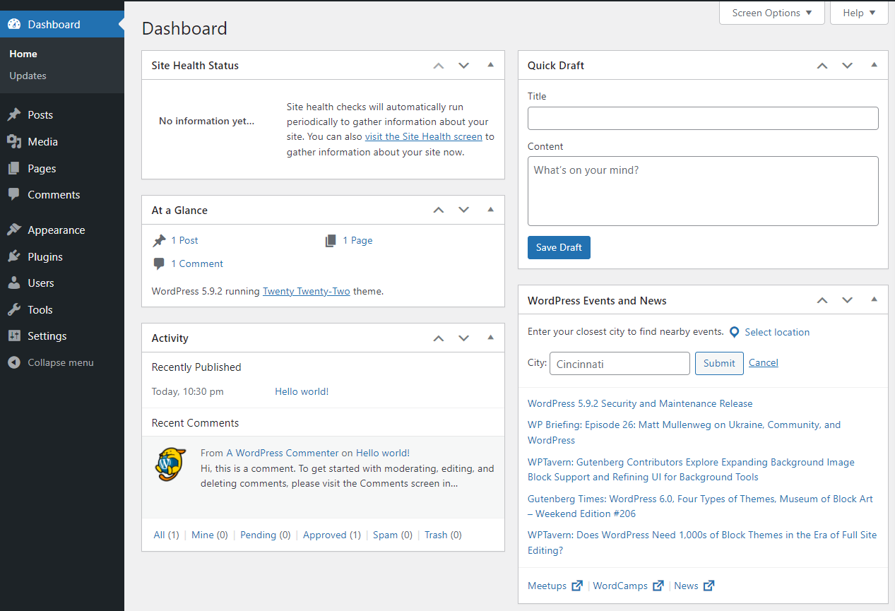

# DevSecOps WordPress Lab

A minimal DevSecOps-themed WordPress environment deployed entirely with
Docker and Docker Compose.
This project demonstrates how to containerize a WordPress + MariaDB
setup, manage configuration through environment variables, and deploy
the application to a remote server as part of the DevSecOps course.

## Table of Contents

-   [Description](#description)
-   [Tech Stack](#tech-stack)
-   [Project Structure](#project-structure)
-   [Quickstart](#quickstart)
    -   [Prerequisites](#prerequisites)
-   [Configuration](#configuration)
    -   [Environment Variables](#environment-variables)
-   [Deployment (Server)](#deployment-server)
-   [Usage](#usage)
-   [Testing checklist](#testing-checklist)
-   [Security notes](#security-notes)
-   [Author](#author)

------------------------------------------------------------------------

## Description

The **DevSecOps WordPress Lab** is a lightweight WordPress deployment
running inside Docker containers.
The setup includes a WordPress application container, a MariaDB database
container, and persistent Docker volumes for data storage.
All configuration values are managed through environment variables,
which must be adjusted individually before deployment.

This project demonstrates: 
- WordPress containerization using Docker & Docker Compose
- Secure and reproducible configuration using environment variables
- Persistent volume-based data handling
- How to deploy a containerized application to a remote server



------------------------------------------------------------------------

## Tech Stack

-   **Application:** WordPress
-   **Database:** MariaDB
-   **Containerization:** Docker & Docker Compose

------------------------------------------------------------------------

## Project Structure

    wordpress-docker/
    ├─ docker-compose.yaml
    ├─ example.env
    ├─ .gitignore
    ├─ README.md
    └─ docs/
       └─ Wordpress_Checklist.pdf
       └─ project-images/
           ├─ homepage.png
           ├─ admin-dashboard.png


------------------------------------------------------------------------

## Quickstart

### Prerequisites

-   Docker installed
-   Docker Compose plugin installed
-   Git installed

------------------------------------------------------------------------

## Configuration

All configuration is controlled through `.env`, which must be created
from the template:

``` bash
cp example.env .env
```

### Environment Variables

These values must be **customized individually**:

``` env
MYSQL_DATABASE=wordpress
MYSQL_USER=wp_user
MYSQL_PASSWORD=change_me_db_password
MYSQL_ROOT_PASSWORD=change_me_root_password

WORDPRESS_DB_HOST=db:3306
WORDPRESS_DB_NAME=wordpress
WORDPRESS_DB_USER=wp_user
WORDPRESS_DB_PASSWORD=change_me_db_password
WORDPRESS_TABLE_PREFIX=wp_
```

------------------------------------------------------------------------

## Deployment (Server)

### 1. Connect to your server

``` bash
ssh <username>@<server-ip>
```

### 2. Verify Docker installation

``` bash
docker --version
```

``` bash
docker compose version
```

### 3. Clone the repository

``` bash
git clone https://github.com/ognjenmanojlovic/wordpress-docker.git
```

``` bash
cd wordpress-docker
```

``` bash
git checkout development
```

### 4. Prepare environment variables

``` bash
cp example.env .env
```

Edit `.env` and adjust: 
- Database name
- Database user and password
- WordPress DB settings

### 5. Start the application

``` bash
docker compose up -d
```

### 6. Open in browser

    http://<server-ip>:8080

### 7. Persistence Test

Create a page in WordPress → restart the stack:

``` bash
docker compose down
```

``` bash
docker compose up -d
```

The page should still exist afterwards.

------------------------------------------------------------------------

## Usage

Once the stack is running on the server, WordPress is fully managed
through the browser.

### Access the application

    http://<server-ip>:8080

### Complete the WordPress installation

You will be prompted to set: 
- Site title
- Admin username
- Admin password
- Email address

### Admin Dashboard

Access the admin area at:

    http://<server-ip>:8080/wp-admin



From the dashboard you can: 
- Create and edit pages
- Create posts
- Change the theme
- Adjust general settings
- Customize menus
- Install or remove plugins

WordPress requires **no additional command-line interaction** after
setup.

------------------------------------------------------------------------

## Testing checklist

-   [x] WordPress runs inside Docker
-   [x] Application deployed on server
-   [x] Persistent volumes work after restart
-   [x] Accessible via `<server-ip>:8080`
-   [x] Environment variables reflect secure configuration

------------------------------------------------------------------------

## Security notes

-   `.env` must **never** be committed
-   Passwords must be changed before deployment
-   Do not expose your server IP in public screenshots
-   No secrets stored in Git

------------------------------------------------------------------------

## Author

**Ognjen Manojlovic**

-   Instagram: https://instagram.com/0gisha
-   LinkedIn: https://www.linkedin.com/in/ognjen-manojlovic-299a2b2a0
